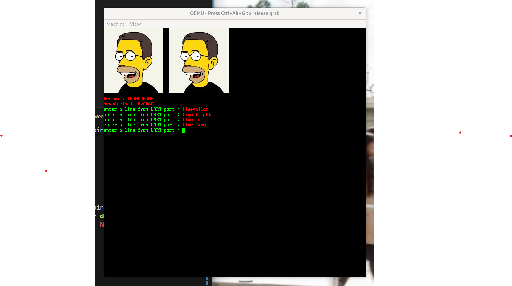

# Lecture Homework Week 05 - Thursday

For this lecture homework, you will explore and modify the LCD device driver.

## Getting the Code

As with the previous lecture homework, this assignment is hosted on GitHub. You will create your own repository using the assignment repository as a template. To do this:

1.  Click on **"Use this template."**
2.  Select **"Create a new repository."**
3.  Give your repository a descriptive name.
4.  Click **"Create repository."**

Once created, clone the repository or open it in a GitHub Codespace to begin working.

### Adding Another Image

If you attempt to compile the program immediately after cloning, it will fail with the following error:

```bash
mkdir build
cmake -S . -B build
cmake --build build
...
arm-none-eabi-objcopy: '../image1.bmp': No such file
...
```

This occurs because only one image, `image0.bmp`, is included in the repository. You must provide a second image (`image1.bmp`). Convert your chosen image to BMP format if it isn't already.

**Requirements:**
* The image must be an appropriate size to fit on the display.
* The display resolution and the size of the existing `image0.bmp` (181 x 198) should be taken into account.
* Must not be a copy of `image0.bmp`. It should be some other appropriate image.

While adding the file allows the code to compile, you must modify the source to display it. First, declare the image in `include/vid.h`. It should look similar to the existing declaration:

```c
extern char _binary____image0_bmp_start;
```

Next, in `src/main.c`, call the `show_bmp` function. There is an existing example that displays the first logo:

```c
char* p = &_binary____image0_bmp_start;
show_bmp(p, 0, 0);  // display a logo
```

Copy and paste this code, updating the pointer to your new image and adjusting the coordinates to place it to the right of `image0.bmp`. Compile and run the code using QEMU:

```bash
qemu-system-arm -M versatilepb -m 128M -kernel build/vid.bin -serial mon:stdio
```

### Changing the Display Resolution

The default code creates a display with a resolution of 640 x 480. In `src/vid.c`, you can change this to 800 x 600. 
1.  Update the `WIDTH` and `HEIGHT` variables. 
2.  Comment out the configuration block for 640 x 480 and uncomment the configuration for 800 x 600.

### Fixing `kprintf`

Your final task is to optimize the `kprintf` helper functions. In the current implementation, `krpx` (hex) and `krpu` (unsigned) are recursive. While recursion is simple for printing digits in reverse order (using the modulo operator), it is non-optimal.

**Your Task:** * Rewrite `krpx` and `krpu` to be **iterative** using loops. 
* **Fix `kprintx`**: By default, the book's version often prints a `0x` prefix. Standard `printf` does not do this automatically. Remove the code that forces the `0x` prefix inside the function.

To verify your changes, add the following test code above the `while(1)` loop in `main.c`:

```c
kprintf("Decimal: %d\n", 1000000000);
kprintf("Hexadecimal: 0x%x\n", 0xABCD);
```

### What to Turn In

Ensure the following files contain your modified code and are pushed to your repository:
* `src/vid.c`
* `src/main.c`
* `include/vid.h`
* `image1.bmp` (in the root directory)

**Proof of Work:**
Run your program and type four different strings into the console. Take a screenshot of the QEMU display showing the two images, the corrected `kprintf` output, and your typed strings. Place this screenshot in the `assets/` directory.

Your output should look something like this:

Once finished:
1.  **Commit and push** your changes to GitHub.
2.  Submit the assignment via **Gradescope**.
3.  Select your repository when prompted.